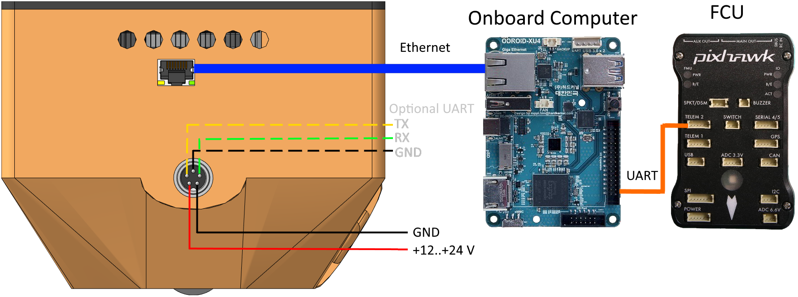
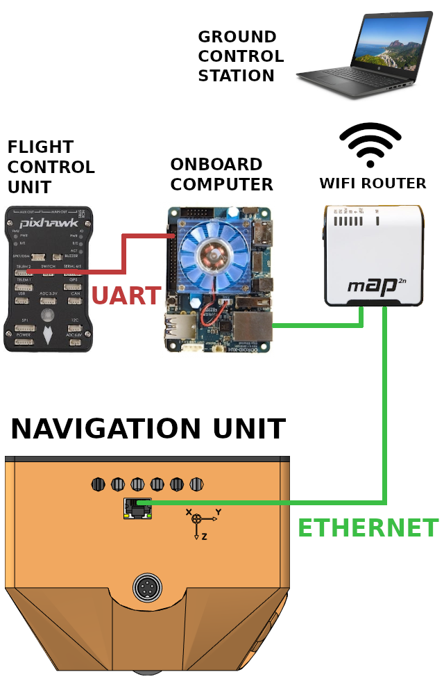

# Навигационный блок

Навигационный блок (НБ) предназначен для вычисления координат летательного аппарата без использования сигналов спутниковой навигации.
Вычисление координат производится на основе изображений с камеры и данных с дальномера, установленных на НБ, а также информации об ориентации летательного аппарата (ЛА), полученной от внешнего источника (полётного контроллера).

Полная документация доступна по [ссылке](https://ntr-navigation-unit.readthedocs.io).

## Подключение

Физическое подключение навигационного блока осуществляется через интерфейс Ethernet 1000BASE-T.
НБ ожидает получения IP-адреса по DHCP.
НБ поддерживает протокол [MAVLink](https://mavlink.io/) версии 1.0 и 2.0 для обмена данными с одноплатными компьютерами и полётным контроллером.
Протокол реализован на [множестве языков](https://mavlink.io/en/getting_started/use_libraries.html).
Наличие высокоуровневых библиотек поддержки на C++ и Python позволяет быстро и эффективно организовать взаимодействие между компонентами дрона для передачи информации и управления.
Протокол содержит специализированные для ЛА сообщения и легко расширяется для реализации дополнительной функциональности.
Для передачи/получения пакетов MAVLink используется порт UDP 14540.

## Режимы работы

Навигационный блок поддерживает 2 основных режима работы: **картирование** и **локализация**.
В режиме **картирования** НБ строит карту местности, над которой находится.
На этом этапе необходимо подавать в НБ глобальные координаты ЛА.
В режиме **локализации** НБ выдаёт координаты ЛА на основе заранее построенной карты местности.

Обычно, на момент старта камера навигационного блока оказывается слишком близко к земле, чтобы можно было надёжно вычислить координаты.
Поэтому сразу после включения НБ выдаёт только информацию о высоте над поверхностью.
Эта высота вычисляется на основе показаний встроенного дальномера и информации о наклоне ЛА относительно горизонта.

Информация о наклоне должна подаваться в навигационный блок от внешнего источника в сообщении [ATTITUDE](https://mavlink.io/en/messages/common.html#ATTITUDE).

После того, как высота над поверхностью превысит значение параметра `INIT_ALT`, произойдёт *инициализация* навигационного блока, и в зависимости от режима он начнёт построение карты, либо начнёт поиск своего положения на загруженной карте.
Только после *инициализации* НБ будет выдавать полный набор координат.

При слишком маленьком значении `INIT_ALT` возможно искажение карты, способное привести к неправильному вычислению координат. Рекомендуется задавать значение `INIT_ALT` не меньше 4 метров.

До момента *инициализации* информация о горизонтальном перемещении ЛА будет недоступна.

### Режим картирования

Для картирования местности необходимо выставить параметр LOAD_MAP в значение “0”, параметр `SAVE_MAP` в значение “1” и регулярно подавать на вход глобальные координаты ЛА (сообщение [GLOBAL_POSITION_INT](https://mavlink.io/en/messages/common.html#GLOBAL_POSITION_INT)).

### Режим локализации

Для локализации на основе построенной карты местности необходимо задать координаты точки старта через параметры `ORIGIN_LAT`, `ORIGIN_LON`, `ORIGIN_ALT` и `ORIGIN_HDG`, а также выставить параметр `LOAD_MAP` в значение “1”, а параметр `SAVE_MAP` в значение “0”.
Также в параметр `MAP_ID` нужно указать индекс карты, записанной в памяти навигационного блока.
В режиме локализации НБ отдаёт глобальные координаты летательного аппарата в сообщении [GLOBAL_POSITION_INT](https://mavlink.io/en/messages/common.html#GLOBAL_POSITION_INT) и координаты в локальной системе координат относительно точки старат в сообщении [VISION_POSITION_ESTIMATE](https://mavlink.io/en/messages/common.html#VISION_POSITION_ESTIMATE).

## Примеры

Примеры работы с навигационным блоком находятся в директории `examples`.
Прежде чем запускать скрипты укажите IP-адрес блока в файле `navblock_ip.txt`

### Простые действия

* `view_params.py` – просмотр параметров
* `set_params.py` – будут отображены текущие параметры, а затем предложено изменить значение любого из них
* `reboot.py` – перезагрузка навигационного блока
* `shutdown.py` – завершение работы навигационного блока
* `download_file.py` – выгрузка карты из навигационного блока. Будет выведен список карт, хранящихся в памяти навигационного блока, а затем будет предложено скачать любую из них
* `upload_file.py` – загрузка карты в навигационный блок. Будет предложено ввести путь к файлу на локальной машине, затем — путь, по которому нужно сохранить файл в памяти навигационного блока
* `disable_vision.py` – отключение вывода координат

### Демо-режимы

Навигационный блок имеет параметр **высота инициализации**.
После включения навигационный блок сопособен выдавать только высоту над поверхностью, пока не достигнет **высоты инициализации**.
Во всех нижеприведённых примерах высота инициализации составляет 1 метр.
Для вычисления высоты над поверхностью требуется информация о наклоне ЛА относительно горизонтального положения.
Для упрощения приведённые скрипты сами генерируют сообщение `ATTITUDE`, считая углы наклона равными 0.

* `view_vision_position.py` – отображение локальных координат. Навигационный блок будет настроен на режим навигации без карты и перезагружен при необходимости. Локальные координаты будут отображаться на экране.
* `view_global_position.py` – отображение глобальных координат. Навигационный блок будет настрое на режим навигации без карты и перезагружен при необходимости. Глобальные координаты будут отображаться на экране. Вычисление текщих глобальных координат производится относительно координат, заданных параметрами `ORIGIN_LAT`, `ORIGIN_LON`, `ORIGIN_ALT`, `ORIGIN_HGT`
* `mapping_mode.py` – построение карты. Навигационный блок будет настроен на режим навигации с сохранением карты. Локальные координаты будут отображаться на экране. Сохранение карты в файл произойдёт если в сообщении `HEARTBEAT`, поступающем на вход навигационного блока, в поле `base_mode` флаг `MAV_MODE_FLAG_SAFETY_ARMED` перейдёт из состояния 1 в 0, что означает выключение двигателей, либо при перезагрузке или завершении работы.
* `localization_mode.py` – определение координат на построенной карте. Навигационный блок будет настроен на режим навигации с готовой картой. Локальные координаты будут отображаться на экране.

### Соединение с полётным контроллером

Для данного примера необходимо установить [MAVProxy](https://ardupilot.github.io/MAVProxy/html/index.html).
Скрипт `flight.bash` запускает MAVProxy таким образом, чтобы обеспечить связь полётного контроллера с навигационным блоком и с наземной станцией.
После установления соединения с полётным контроллером, будет запущен скрипт `pixhawk/mavinit.scr`, который запросит у полётного контроллера информацию о наклоне с частотой 20 Гц.

