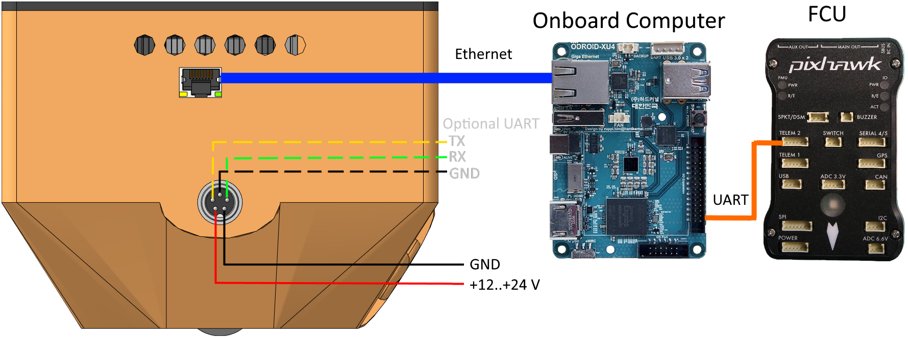

.. Copyright 2020, NTRobotics

   Licensed under the Apache License, Version 2.0 (the "License");
   you may not use this file except in compliance with the License.
   You may obtain a copy of the License at

       http://www.apache.org/licenses/LICENSE-2.0

   Unless required by applicable law or agreed to in writing, software
   distributed under the License is distributed on an "AS IS" BASIS,
   WITHOUT WARRANTIES OR CONDITIONS OF ANY KIND, either express or implied.
   See the License for the specific language governing permissions and
   limitations under the License.

Описание
========

Навигационный блок (НБ) предназначен для вычисления координат летательного аппарата (ЛА) без использования сигналов спутниковой навигации.
Вычисление координат производится на основе изображений с камеры и данных с дальномера, установленных на |НБ|, а также информации об ориентации летательного аппарата, полученной от внешнего источника (полётного контроллера).

Подключение
-----------
Физическое подключение навигационного блока осуществляется через интерфейс Ethernet 1000BASE-T.
|НБ| ожидает получения IP-адреса по DHCP.
|НБ| поддерживает протокол MAVLink_ версии 1.0 и 2.0 для обмена данными с одноплатными компьютерами и полётным контроллером.
Протокол реализован на множестве языков [#]_.
Наличие высокоуровневых библиотек поддержки на C++ и Python позволяет быстро и эффективно организовать взаимодействие между компонентами дрона для передачи информации и управления.
Протокол содержит специализированные для |ЛА| сообщения и легко расширяется для реализации дополнительной функциональности.
Для передачи/получения пакетов MAVLink используется порт UDP 14540.

.. _MAVLink: https://mavlink.io/
.. [#] https://mavlink.io/en/getting_started/use_libraries.html

.. seealso:: Подробное описание поддерживаемых сообщений смотри в разделе :ref:`Протокол <protocol-description>`

Питание
-------
| Входное напряжение: 12-24 В
| Потребление: макс. 38 Вт

Схема подключения
-----------------

Режимы работы
-------------
Навигационный блок поддерживает 2 основных режима работы: картирование и локализация.
В режиме картирования |НБ| строит карту местности, над которой находится.
На этом этапе необходимо подавать в |НБ| глобальные координаты |ЛА|.
В режиме локализации |НБ| выдаёт координаты |ЛА| на основе заранее построенной карты местности.

Обычно, на момент старта камера навигационного блока оказывается слишком близко к земле, чтобы можно было надёжно вычислить координаты.
Поэтому сразу после включения |НБ| выдаёт только информацию о высоте над поверхностью.
Эта высота вычисляется на основе показаний встроенного дальномера и информации о наклоне |ЛА| относительно горизонта.

.. important::
   Информация о наклоне должна подаваться в навигационный блок от внешнего источника в сообщении ATTITUDE_.

После того, как высота над поверхностью превысит значение параметра |INIT_ALT|, произойдёт *инициализация* навигационного блока, и в зависимости от режима он начнёт построение карты, либо начнёт поиск своего положения на загруженной карте.
Только после *инициализации* |НБ| будет выдавать полный набор координат.

.. tip:: При слишком маленьком значении |INIT_ALT| возможно искажение карты, способное привести к неправильному вычислению координат. Рекомендуется задавать значение |INIT_ALT| не меньше 4 метров.

.. warning::
   До момента *инициализации* информация о горизонтальном перемещении |ЛА| будет недоступна.

Режим картирования
~~~~~~~~~~~~~~~~~~
Для картирования местности необходимо выставить параметр |LOAD_MAP| в значение “0”, параметр |SAVE_MAP| в значение “1” и регулярно подавать на вход глобальные координаты |ЛА| (сообщение GLOBAL_POSITION_INT_).

Режим локализации
~~~~~~~~~~~~~~~~~
Для локализации на основе построенной карты местности необходимо задать координаты точки старта через параметры |ORIGIN_LAT|, |ORIGIN_LON|, |ORIGIN_ALT| и |ORIGIN_HDG| (см. Parameter Protocol), а также выставить параметр |LOAD_MAP| в значение “1”, а параметр |SAVE_MAP| в значение “0”.
Также в параметр MAP_ID нужно указать индекс карты, записанной в памяти навигационного блока.
В режиме локализации |НБ| отдаёт глобальные координаты летательного аппарата в сообщении GLOBAL_POSITION_INT_ и координаты в локальной системе координат относительно точки старат в сообщении VISION_POSITION_ESTIMATE_.

.. |INIT_ALT| replace:: :ref:`INIT_ALT<init_alt_param>`
.. |LOAD_MAP| replace:: :ref:`LOAD_MAP<load_map_param>`
.. |SAVE_MAP| replace:: :ref:`SAVE_MAP<save_map_param>`
.. |ORIGIN_LAT| replace:: :ref:`ORIGIN_LAT<origin_lat_param>`
.. |ORIGIN_LON| replace:: :ref:`ORIGIN_LON<origin_lon_param>`
.. |ORIGIN_ALT| replace:: :ref:`ORIGIN_ALT<origin_alt_param>`
.. |ORIGIN_HDG| replace:: :ref:`ORIGIN_HDG<origin_hdg_param>`

.. _GLOBAL_POSITION_INT: https://mavlink.io/en/messages/common.html#GLOBAL_POSITION_INT
.. _VISION_POSITION_ESTIMATE: https://mavlink.io/en/messages/common.html#VISION_POSITION_ESTIMATE
.. _ATTITUDE: https://mavlink.io/en/messages/common.html#ATTITUDE

Подключение навигационного блока к устройствам с нестандартными программными и аппаратными интерфейсами (UART)
--------------------------------------------------------------------------------------------------------------
Для подключения |НБ| к устройствам с интерфейсом UART используется блок согласования, который подключается по Ethernet к |НБ|, а по UART - к устройству заказчика.
Конфигурация блока согласования производится по WiFi или USB (опционально).
Протокол в данном случае согласуется с заказчиком.

.. |НБ| replace:: :abbr:`НБ (навигационный блок)`
.. |ЛА| replace:: :abbr:`ЛА (летательный аппарат)`