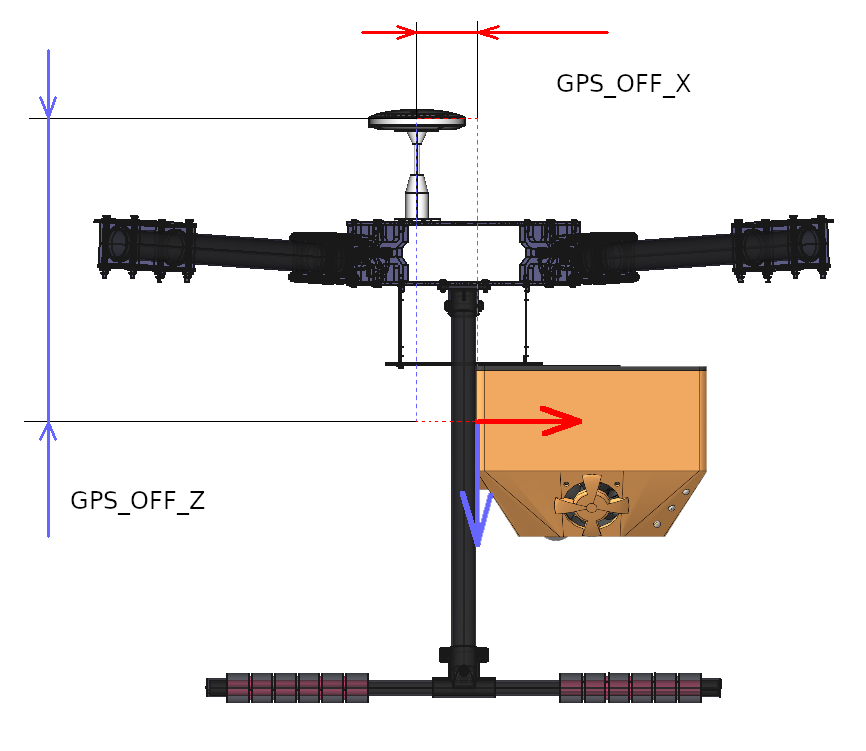

.. Copyright 2020, NTRobotics

   Licensed under the Apache License, Version 2.0 (the "License");
   you may not use this file except in compliance with the License.
   You may obtain a copy of the License at

       http://www.apache.org/licenses/LICENSE-2.0

   Unless required by applicable law or agreed to in writing, software
   distributed under the License is distributed on an "AS IS" BASIS,
   WITHOUT WARRANTIES OR CONDITIONS OF ANY KIND, either express or implied.
   See the License for the specific language governing permissions and
   limitations under the License.

Параметры
=========

.. list-table::
    :header-rows: 1

    *   - Имя параметра
        - Тип
        - Единицы измерения
        - Допустимы значения
        - Описание

          .. _origin_lat_param:
    *   - ORIGIN_LAT
        - float
        - градусы
        - -90.0..+90.0
        - широта точки старта

          .. _origin_lon_param:
    *   - ORIGIN_LON
        - float
        - градусы
        - -180.0..+180.0
        - долгота точки старта

          .. _origin_alt_param:
    *   - ORIGIN_ALT
        - float
        - метры
        - любые
        - высота точки старта над уровнем моря

          .. _origin_hdg_param:
    *   - ORIGIN_HDG
        - float
        - градусы
        - 0.0..360.0
        - географический азимут в точке старта

    *   - GPS_OFF_X
        - float
        - метры
        - любые
        - смещение источника глобальных координат относительно |НБ| по оси  X (`рис. 1`_)

    *   - GPS_OFF_Y
        - float
        - метры
        - любые
        - смещение источника глобальных координат относительно |НБ| по оси  Y (`рис. 1`_)

    *   - GPS_OFF_Z
        - float
        - метры
        - любые
        - смещение источника глобальных координат относительно |НБ| по оси  Z (`рис. 1`_)

    *   - ORIENT
        - float
        - градусы
        - -180.0..+180.0
        - угол поворота |НБ| относительно относительно |ЛА| в горизонтальной плоскости (`рис. 2`_)

    *   - SEND_ORIGIN
        - int
        - –
        - 0, 1
        - если стоит ``1``, в момент инициализации будет отправлено сообщение GPS_GLOBAL_ORIGIN_ с глобальными координатами точки отсчёта

          .. _init_alt_param:
    *   - INIT_ALT
        - float
        - метры
        - 0.0..80.0
        - минимальная высота инициализации |НБ|

          .. _save_map_param:
    *   - SAVE_MAP
        - int
        - –
        - 0, 1
        - если стоит ``1``, карта будет сохранена в момент посадки |ЛА|

          .. _load_map_param:
    *   - LOAD_MAP
        - int
        - –
        - 0, 1
        - если стоит ``1``, при включении будет загружена карта с индексом, указанным в параметре :ref:`MAP_ID<map_id_param>`

          .. _map_id_param:
    *   - MAP_ID
        - int
        - –
        - 1..18446744073709551615
        - индекс карты для для загрузки (если :ref:`LOAD_MAP<load_map_param>` = 1)

.. _GPS_GLOBAL_ORIGIN: https://mavlink.io/en/messages/common.html#GPS_GLOBAL_ORIGIN

.. _`рис. 1`:

.. _`рис. 2`:

.. |НБ| replace:: :abbr:`НБ (навигационный блок)`
.. |ЛА| replace:: :abbr:`ЛА (летательный аппарат)`